# Jmeter 函数介绍

## Jmeter函数是什么？

&emsp;&emsp;Jmeter中函数，就相当于我们小时候学的未知数X，在jmeter中函数的作用是用来替代某个一==需要计算的不确定的值==，它可以用在几乎任何地方。在Jmeter中函数的表示方式如下：

${__函数名(参数1,参数2,...参数n)}

##  Jmeter有哪些函数

&emsp;&emsp;Jmeter内置了48个函数，以我们当前业务场景来说，使用到内置函数的频率不高，目前常用的可能就2个。一个是[__time](https://jmeter.apache.org/usermanual/functions.html#__time),另一个就是[__digest](https://jmeter.apache.org/usermanual/functions.html#__digest),详细的函数列表可以到[函数列表](https://jmeter.apache.org/usermanual/functions.html#functions)查询。

- \_\_time用于获得当前时间，可以通过[SimpleDateFormat](https://docs.oracle.com/javase/8/docs/api/java/text/SimpleDateFormat.html)来指定输出结果的格式，如返回年/月/日则函数书写为 ==\$\{\_\_time(YYYY/MM/DD,)}==在==脚本运行时==将得到==2019/01/04==
- \_\_digest用于字符加密，支持多种加密算法，如，对支付Abc进行MD5加密则书写格式为：==\${\_\_digest(MD5,Abc,,,)}==在==脚本运行时==将得到结果==35593b7ce5020eae3ca68fd5b6f3e031==

## Jmeter函数如何使用？

&emsp;&emsp;函数在Jmeter中使用方式，就和普通值一样，只需要按照规定格式填写即可，下面举几个例子来进行简单说明。

- 在使用函数前，我们先简单了解下函数的含义。建议去查询[函数列表](https://jmeter.apache.org/usermanual/functions.html#function),明白函数的基本含义后，我们可以使用Jmeter内置的函数助手来进行函数的编写。

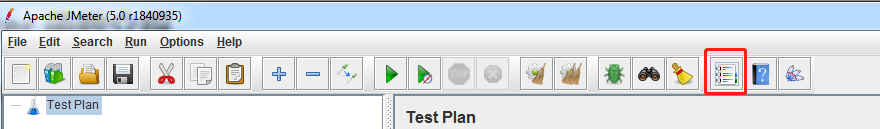

- 在函数助手中选择所需要的函数，并根据要求填写函数所需要的参数信息。
<br/>
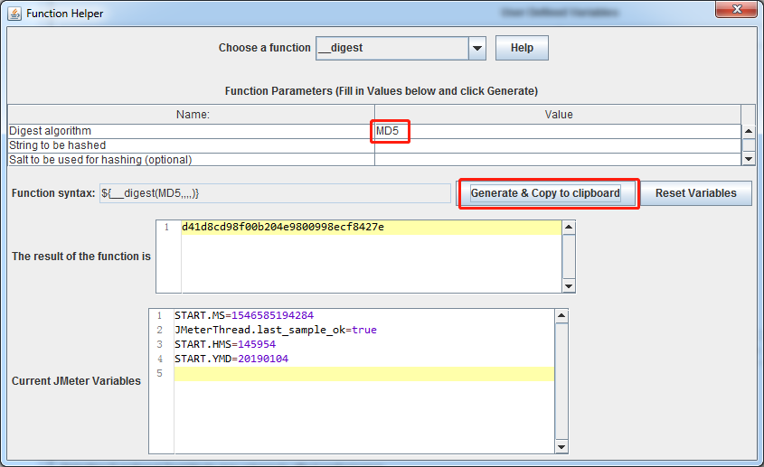

- 在脚本中使用需要的函数,使用方式如同Jmeter变量一样，在需要的地方直接填写即可，示例如下：

  ```
  {"type":${type},
  "timestamp":"${__time(,)}"
  }
  ```

- 在用户定义变量中使用
  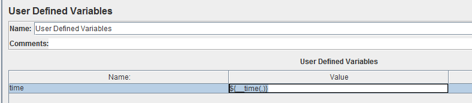


- 示例脚本下载

## 内置函数不够了怎么办？

  &emsp;&emsp;在有些时候，Jmeter内置函数可能是无法满足我们的业务需求，这个时候，我们就需要自己去编写函数，来简化脚本的编写。自己编写的函数和内置函数在用法上都是一样的。

# Jmeter编写自定义函数

&emsp;&emsp; 在自己编写Jmeter函数时需要注意以下几点：

- 自定义函数所在的包名应包括==.functions==且不包括==.gui==

- 函数名需要以==__==开头

- 函数类需要继承AbstractFunction并实现其方法

  - getArgumentDesc-- 参数描述信息

  - execute-- 函数主体部分

  - setParameters-- 函数的参数

  - getReferenceKey-- 函数的名字
    <br/>Tips：如果需要修改默认函数的识别方式（Classpath finder）可以到jmeter.properties去修改，但可能会导致其他第三方的插件失效，建议保持默认

    ```
    # Classpath finder
    # ================
    # The classpath finder currently needs to load every single JMeter class to find
    # the classes it needs.
    # For non-GUI mode, it's only necessary to scan for Function classes, but all classes
    # are still loaded.
    # All current Function classes include ".function." in their name,
    # and none include ".gui." in the name, so the number of unwanted classes loaded can be
    # reduced by checking for these. However, if a valid function class name does not match
    # these restrictions, it will not be loaded. If problems are encountered, then comment
    # or change the following properties:
    classfinder.functions.contain=.functions.
    classfinder.functions.notContain=.gui.
    
    ```

## 如何编写自定义函数

### 工具准备

&emsp;&emsp;在开始编写自定义函数前，你需要先下载一个JAVA IDE，这里使用Eclipse

### 新建工程

* 在Eclipse中新建一个Maven工程File-New-Project...<br/>
  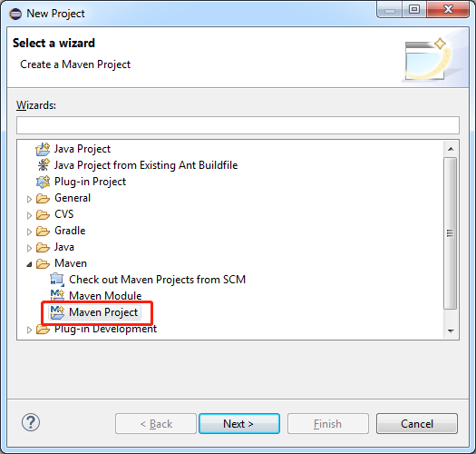

* 勾选Create a simple project
   <br/>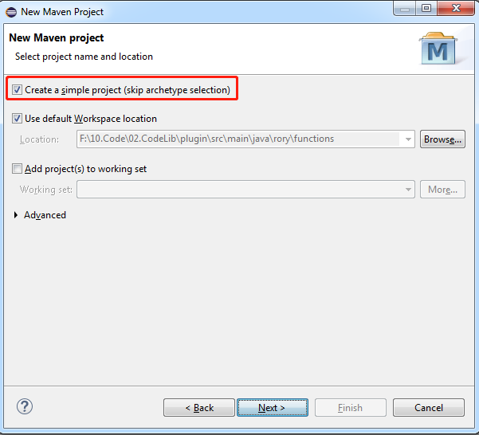<br/>

* 输入Group Id和Artifact id
然后点击Finish<br/>
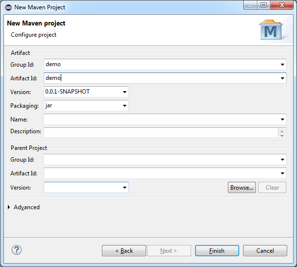

### 新建包

- 在src/main/java 上点击右键，然后选择new，并选择package<br/>
  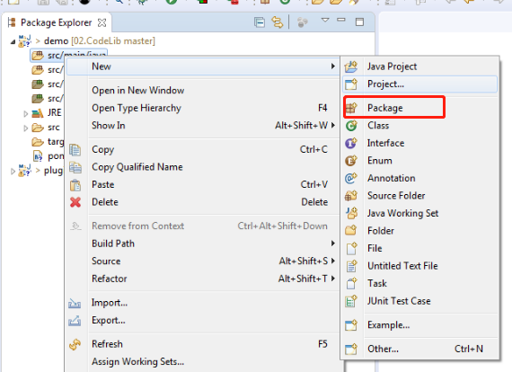

- 包名随意，但包名中一定要包含==.functions.==否则jmeter将不会识别该函数。<br/>
  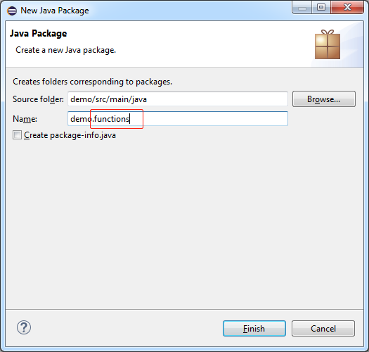

### 添加依赖包

&emsp;&emsp;在开始编写自己的函数时，我们需要先添加Jmeter的依赖包。本例中使用到了Maven，因此只需要编辑项目里的==pom.xml==文件即可。在自己的文件中添加如下内容，并点击保存(Eclipse会联网进行下载所需要的jar,需要等一段时间)

```xml-dtd
 <dependencies>
  <dependency>
			<groupId>org.apache.jmeter</groupId>
			<artifactId>ApacheJMeter_core</artifactId>
			<version>5.0</version>
		</dependency>
		<dependency>
			<groupId>org.apache.jmeter</groupId>
			<artifactId>ApacheJMeter_components</artifactId>
			<version>5.0</version>
</dependency>
</dependencies>
```

完成的配置文件如下：

```xml
<project xmlns="http://maven.apache.org/POM/4.0.0" xmlns:xsi="http://www.w3.org/2001/XMLSchema-instance" xsi:schemaLocation="http://maven.apache.org/POM/4.0.0 http://maven.apache.org/xsd/maven-4.0.0.xsd">
  <modelVersion>4.0.0</modelVersion>
  <groupId>demo</groupId>
  <artifactId>demo</artifactId>
  <version>0.0.1-SNAPSHOT</version>
   <dependencies>
  <dependency>
			<groupId>org.apache.jmeter</groupId>
			<artifactId>ApacheJMeter_core</artifactId>
			<version>5.0</version>
		</dependency>
		<dependency>
			<groupId>org.apache.jmeter</groupId>
			<artifactId>ApacheJMeter_components</artifactId>
			<version>5.0</version>
</dependency>
</dependencies>
</project>
```


### 新建类

&emsp;&emsp;在创建了包之后，就到了函数编写的步骤了。让我们一起来完成我们的第一个函数吧。

- 新建类
  - 类名命名和函数名一致（建议）
  - 继承==org.apache.jmeter.functions.AbstractFunction==类（必须）
- 实现AbstractFunction类的抽象方法
- 完整代码如下：
```java
package demo.functions;

import java.text.SimpleDateFormat;
import java.util.Collection;
import java.util.Date;
import java.util.LinkedList;
import java.util.List;

import org.apache.jmeter.engine.util.CompoundVariable;
import org.apache.jmeter.functions.AbstractFunction;
import org.apache.jmeter.functions.InvalidVariableException;
import org.apache.jmeter.samplers.SampleResult;
import org.apache.jmeter.samplers.Sampler;

public class getTime extends AbstractFunction {
	// Define the function name,the name must be start with__.
	private static final String KEY = "__getTime";


	// Define the description about the parameter,this text will help user
	// understand it.
	private static final List<String> desc = new LinkedList<String>();
	static {
		desc.add("Formt the time(optional)");
	}

	// The object array use for store the user input parameter.
	private Object[] values;

	// Get the description and show in jmeter helper.
	public List<String> getArgumentDesc() {

		return desc;
	}

	
	//Logic,The result will return jmeter.
	@Override
	public String execute(SampleResult previousResult, Sampler currentSampler) throws InvalidVariableException {
		
		Date currentDate=new Date();
		String currentdate=currentDate.toString();
		//If the parameter is empty will default value.
		if(values.length>0) {
			SimpleDateFormat df = new SimpleDateFormat(((CompoundVariable) values[0]).execute().trim());
			currentdate=df.format(currentDate);
		}
	
		return currentdate;
	}

	//Covent the parameters to array.
	@Override
	public void setParameters(Collection<CompoundVariable> parameters) throws InvalidVariableException {
		
		values = parameters.toArray();// save parameter.

	}

	// Get define function name and display in jmeter helper.
	@Override
	public String getReferenceKey() {

		return KEY;
	}

}

```

- 把代码导出为jar文件。

  - 在要导出的类或包上点击右键，选择export<br/>
    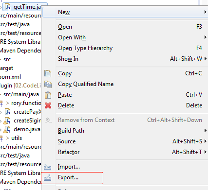

  - 找到Java并选择jar<br/>
    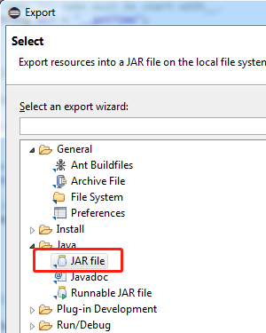

  - 指定存放路劲,导出类文件和资源，然后点击Finish<br/>
  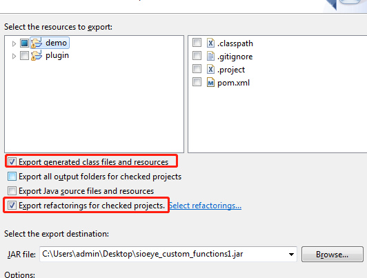
- 把导出的jar文件放到Jmeter安装路径的==lib/ext== 目录下
- 重启jmeter就可以了效果如下：<br/>
 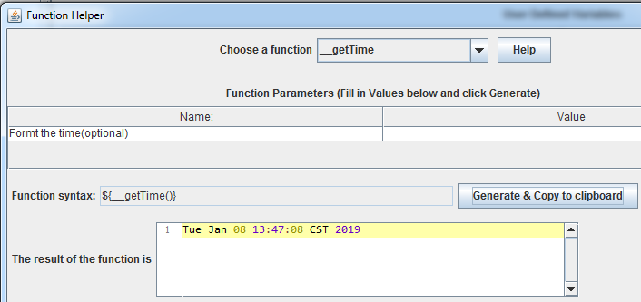
